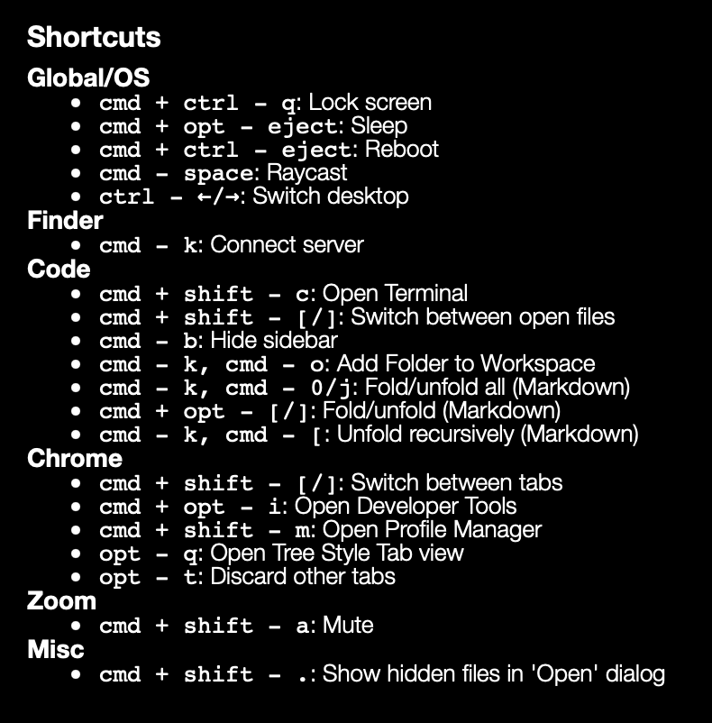
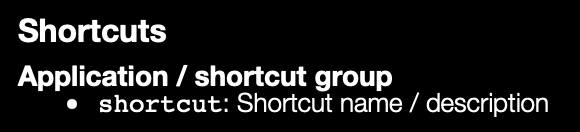

# Shortcuts widget for Übersicht

This [Übersicht](http://tracesof.net/uebersicht/) widget displays keyboard shorcuts.



## How to install

- Create a new directory in the Übersicht widgets directory, e.g. `shortcuts`, and place [`shortcuts.jsx`](shortcuts.jsx) and [`shortcuts.json`](shortcuts.json) in it.
- Open the `shortcuts.jsx` file and adjust values in the "CUSTOMIZE ME" section to adjust widget placement and size.
- Open the `shortcuts.json` file and adjust list of shortcuts to display.

The format of the [`shortcuts.json`](shortcuts.json) file looks such:

```json
{
  "Application / shortcut group": {
    "Shortcut name / description": "shortcut",
  }
}
```


